# **HOME CREDIT DEFAULT RISK - DATA ANALYSIS, MODELING AND DEPLOYMENT**  <a class="jp-toc-ignore"></a>


**Home Credit Group** is a non-bank financial institution that specializes in installment lending to individuals with limited or no credit history. It was founded in 1997 and offers loans to clients in 9 countries. The institution provides three types of services: cash loans, point-of-sale loans, and revolving loans. All loans are denominated in the client's currency.

Over the years, the company has accumulated a substantial database of loan applications and borrower behavioral data. This data is leveraged to predict whether a client is at risk of defaulting on their loan payments.

The dataset and its description, as provided by Home Credit Group, are available on [Kaggle](https://www.kaggle.com/c/home-credit-default-risk/data) as part of the Home Credit competition.

Structure of Tables:

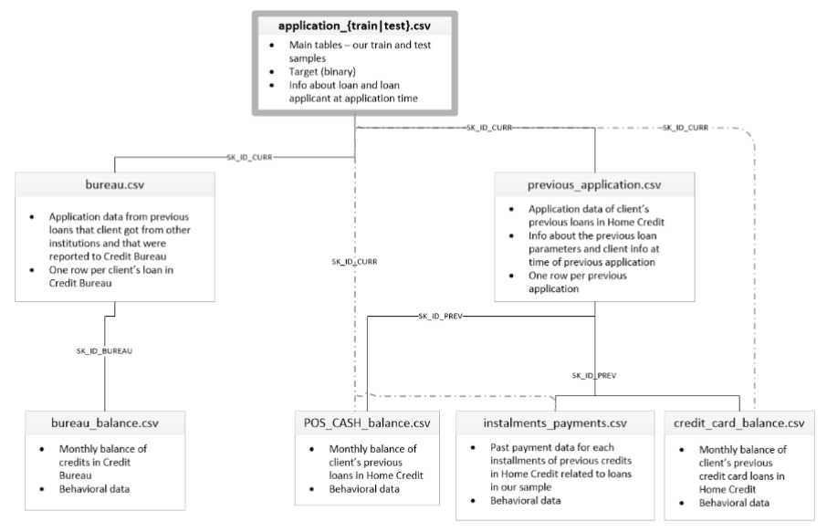

This project focuses on:
* data analysis and getting insight from correlations between dependent and independent variables- **[EDA.ipynb](EDA.ipynb)**
* engineering and selecting features- **[Engineering.ipynb](Engineering.ipynb)**
* fitting models to data- **[Modeling.ipynb](Modeling.ipynb)**
* creating pipeline for entries from new applicants without credit history- **[Finalising_pipeline.ipynb](Finalising_pipeline.ipynb)**
* deploying best performing model to Google Cloud Platform- **[deployment_fastapi](deployment_fastapi)** , **[deployment_vertexai](deployment_vertexai)**

# EDA.ipynb

## Steps
* loading data
* splitting data to analyse only the training set
* checking distribution of target variable
* analysing correlations with the target (categorical- chi-square test, numerical- anova test)
* removing multicollinear features
* plotting and analysing most correlated features

## Conclusions
*    Imbalanced Target Distribution:
        The distribution of the target variable is highly imbalanced, which can lead to modeling challenges. Techniques such as oversampling, undersampling, or the use of class weights will be considered to address this issue.

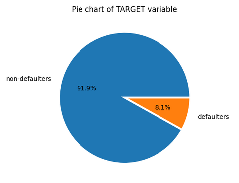


*    Handling Erroneous Numerical Data:
        Certain numerical features contain erroneous values that require preprocessing. Data cleansing and imputation techniques will be applied to handle these discrepancies.

*    Feature Removal:
        Features that have shown no significant correlation with the target variable will be removed to simplify the model and potentially improve its performance.

*    Outliers Retention:
        Outliers in the dataset will not be removed as they may contain valuable information and patterns. They will be leveraged in the analysis to extract meaningful insights.

*    Important Features from application_train.csv:
        Key features from the application_train.csv dataset include scorings from external sources, age, days since the last change of phone, the age of the owned car, amount of credit, days since the ID was published, as well as categorical variables such as occupation type, gender, income type, working and living in the same region, providing work phone, certain types of documentation, family status, housing type, and education type.

*    Important Features from bureau.csv:
        Critical features from the bureau.csv dataset include the number of days before the current application the client applied for credit in the Credit Bureau, the remaining duration of Credit Bureau credit at the time of application, credit activity status, and credit type.

*    Critical Features from bureau_balance.csv:
        Both columns in the bureau_balance.csv dataset are correlated with the target and will be included in the analysis.

*    Relevant Features from previous_application.csv:
        Features that add value to the model from the previous_application.csv dataset include the term of the previous credit at application, the decision date of the last credit, the date of the first drawing, rejection reason codes, and the purpose of the cash loan, especially if this data is available.

*    Important Features from installments_payments.csv:
        Columns related to payment dates and payment delays in the installments_payments.csv dataset are correlated with the target. Feature engineering will be applied to these columns to extract additional information.

*    Significant Features from credit_card_balance.csv:
        Features such as the balance during the month of the previous credit and the number of paid installments made in the credit_card_balance.csv dataset will be leveraged for feature engineering to improve model performance.

*    Potential of POS_CASH_balance.csv:
        Although POS_CASH_balance.csv currently lacks directly correlated features, aggregating and feature engineering may uncover valuable patterns and relationships with the target variable.

*    Aggregation and Feature Engineering:
        Aggregating and performing advanced feature engineering on relevant datasets can significantly enhance the model's predictive power by creating new informative features and improving correlations with the target variable.

# Engineering.ipynb

## Steps
* Data Cleaning based on insight from Exploratory Data Analysis (EDA)
* Feature Engineering: Creating new features to enhance predictive power.
* Cardinality Reduction: Reducing the number of distinct categories in categorical variables.
* Aggregation and Data Transformation: Calculating the number of previous credits and aggregating behavioral data over the last 2 years and beyond 2 years.
* Feature Selection: Identifying features with stable distributions and a single-feature ROC_AUC performance exceeding 0.52 in predicting the target variable.
* Data Saving: Saving the preprocessed data for future use.
* Pipeline saving for use in Finalising_pipeline.ipynb

## Conclusions
Features with the most reliable predictive value are derived from the mean values of the target variable of training set among the nearest neighbors. Among all the features, those from the application_train.csv dataset exhibit the highest predictive performance. In contrast, features selected from other datasets tend to have a lower roc_auc score, often falling below the 0.52 set threshold for single feature. However, it's essential to note that even these less performant features can still be valuable in predicting defaults.

# Modeling.ipynb

## Steps

* Modeling on features form application_train.csv only
  
* Modeling on merged data from all selected features:
    * Selecting method of imputation of missing values
    * Checking performance of SVM, LogisticRegression, RandomForestClassifier, XGBClassifier and LGBMClassifier
    * Selecting XGBClassifier and LGBMClassifier for hyperparameter tuning with hyperopt in stratified cross validation
    * Selecting model with best roc_auc score

* Training best performing model
  
* Interpretation of the model with selection of best performing features and presenting them with help of shap library

* Displaying threshold graphs for roc curve, precision-recall curve and business metric

* Generating confusion matrix and report for chosen threshold

## Conclusions

* The average ROC_AUC score for data from the application_train dataset is 0.76.

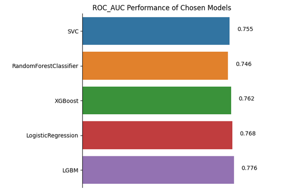

* When comparing with ROC_AUC score from models train on data from other tables as well we see a rise, which means the features from other tables give a boost to the metric.

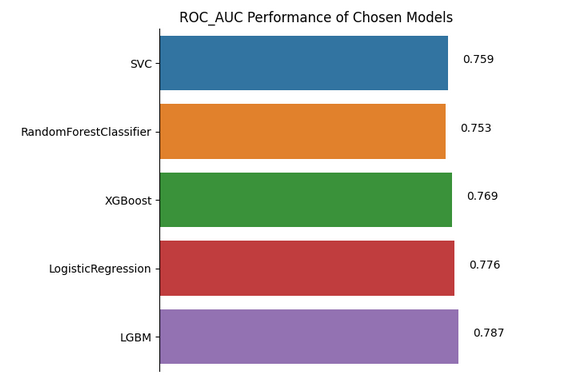

* The best-performing model achieved a mean ROC_AUC of 0.789 across five stratified folds during training, and it scored 0.780 on the test set. Slight overfitting is expected when tuning hyperparameters on folds.

* The most important features are generated based on external sources and data from nearest neighbours.

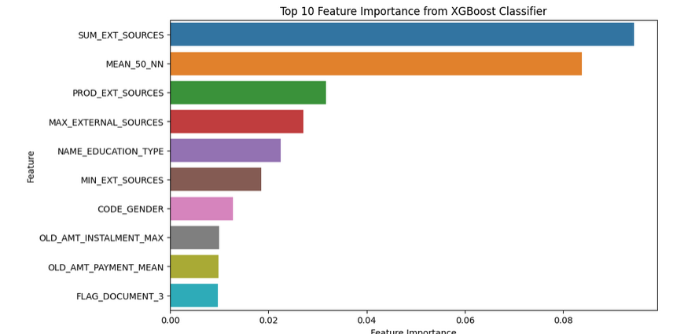

* Features that contibute defaulting:

    highier values of mean target for 50 nearest neighbours
    lower values of sum from external sources
    lower minimum values of diffence in expected and actual payments for credits from last 2 years
    being male
    highier values of ratio of credit amount to external source 3
    lower number of days of employment
    lower education score
    delivered document 3

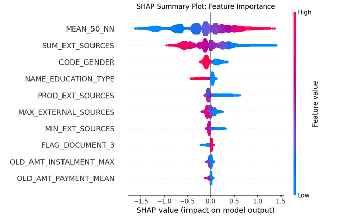


* Determining the optimal threshold for predictions can be done using various methods such as:

    * ROC curve

    * precision-recall curve

    * business-specific metrics which in this case is lost amount devided by total lent amount. Ideally in this case, a business metric should consider comparing losses incurred from lending to defaulting clients versus losses from not extending loans to potential clients capable of repayment


<table>
    <tr>
        <td>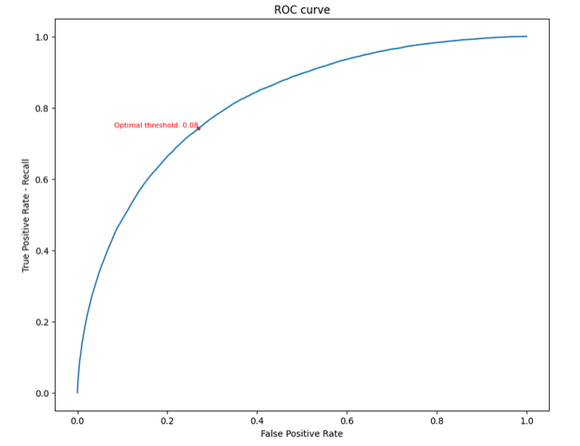</td>
        <td>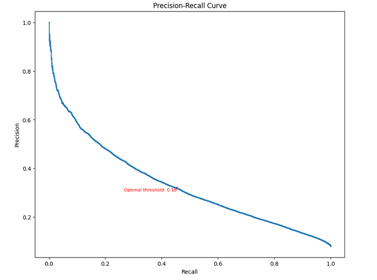</td>
        <td>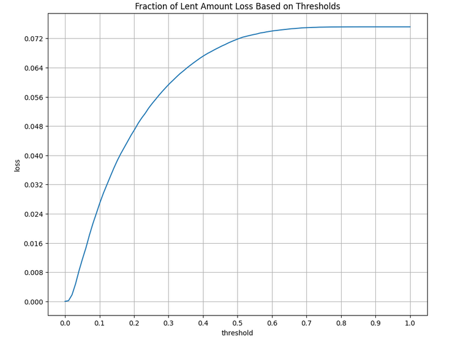</td>
    </tr>
</table>


* Currently, the threshold is set to 0.18, resulting in a 4% loss of the total lent amount, as opposed to the 7% loss incurred with the current prediction method.
  
* For threshold set to 0.18 we see a bit highier recall than precision for defaulters which is desirable to minimise the loss.

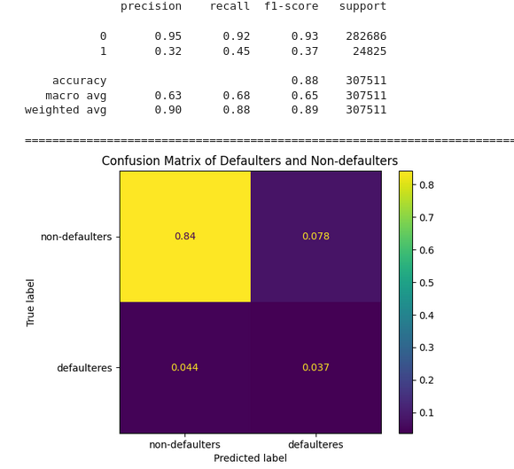

* The model's applicability extends to clients with both no credit history and a credit history. For each group of clients, thresholds and business metrics can be calculated independently.

* To establish the true threshold, access to loan profitability metrics and additional features for calculation would be required.

# Finalising_pipeline.ipynb

## Steps

* Preparation of final pipeline
* Generating and storing final pipeline for future predictions 
* Testing of final pipeline on best performing model
* Instructions to follow to make predictions

## Conclusions

To make batch prediction:

* Run the imports and functions from this notebook
* Select rows of interest from the dataframe and store in variable ```X_pred```
* Transform with final pipeline: ```X_transformed = final_pipeline.transform(X_pred)```
* Make predictions of defaulting: ```model.predict_proba(X_transformed)```
  
To make predictions via API:  
* Run the imports and functions from this notebook
* Prepare the entry in DataFrame format assign to ```X_api```
* Transform the entry: ```X_api = final_pipeline.transform(X_api)```
* Change the type of data to dictionary: ```X_api = X_api.to_dict(orient='record')[0]```
* Make a json format: ```json.dumps(X_api)```
* Go to https://default-risk-fastapi-f4fhso7e5q-nw.a.run.app/docs
* Click *predict* then *try it out*
* Copy prepared input and past in a given format
* Make predictions

Trying out process gives the outcome: 

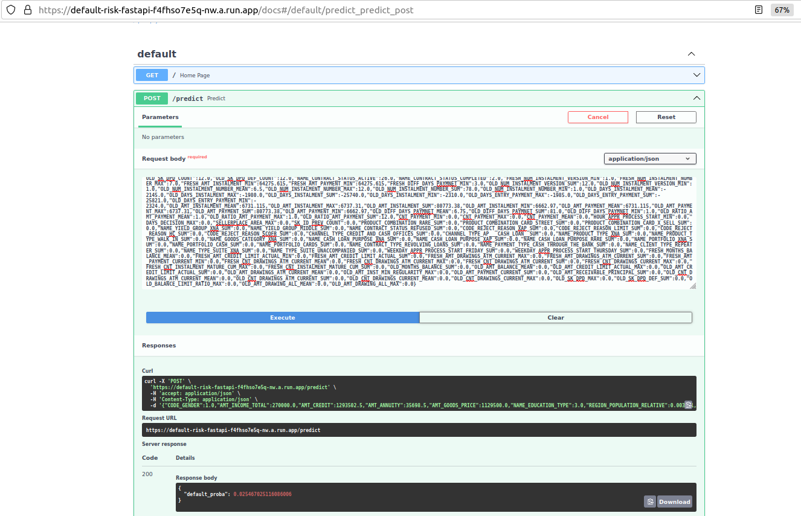

# Deployments

## Model deployment with FastAPI

### Steps
* Building Docker image of application
* Deploying with Cloud Run
* Checking the response time with the locust

### Conclusions
* The model is deployed and accessible through the link: https://default-risk-fastapi-f4fhso7e5q-nw.a.run.app
* To get the prediction of the model follow the steps:
    * prepare json file with structure like in ex_entry.json 
    * go to https://default-risk-fastapi-f4fhso7e5q-nw.a.run.app/docs
    * click try it out and past prepared entries in correct formated
* Performance of deployment is available in [locust_report.html](deployment_fastapi/locust_report.html)

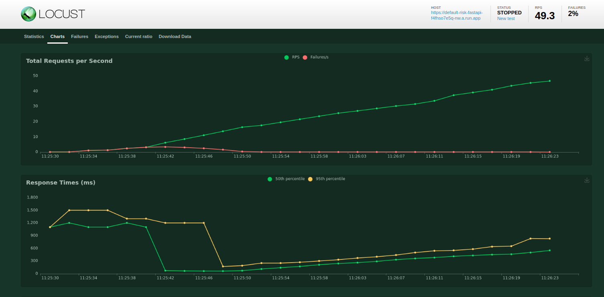

The app is deployed using possibly little resources and doesn't perform it's best with a cold start. The start of the app usually takes longer than 1 second for a client and causes RunTime Errors until GCP starts to scale up automatically.

To resolve the problem the deployment parameters would need to be changed to better performing machine and more memory allocated.

## Model deployment with VertexIA

### Steps
* Storing model in a storage bucket in GCP
* Importing model from bucket to Model Registry in VertexAI
* Deploying model to the endpoint
* Checking the response time with request library

### Conclusions
* The model accesibility is private and could be changed by assigning rights of access to the endpoint
* The model was tested with [endpoint_testing.py](deployment_vertexai/endpoint_testing.py)
* As the deployment was done minimising the costs of use of platform, getting the request took also around 1s.

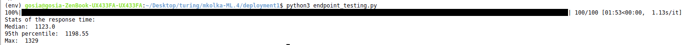


# Running the code

1. Clone the repo to your local machine: ```git clone https://github.com/TuringCollegeSubmissions/mkolka-ML.4.git```
2. Go to the folder where you cloned the repo.
3. Create local environment with name of folder assign to env: ```python -m venv env```
4. Activate local environment: Linux ```source env/bin/activate```, Windows CMD ```env\Scripts\activate```
5. Install dependencies from [requirements.txt](requirements.txt): ```pip install -r requirements.txt```
6. Download dataset from the [Kaggle](https://www.kaggle.com/c/home-credit-default-risk/data) competition and unzip the files to your repo
7. Run the code 

# Summary

* Features from application_train.csv have the highiest predictive power in accessign if a client would default on the credit. Especially information from external sources.
* The final model was built with use of XGBoost library and achieved ROC_AUC equal to 0.78 on testing set.
* Features comming from historical data improve the model metric ROC_AUC by 0.02.
* The performance of thresholds dictated by different methods lowers the loss of the organization by identifying defaulters.
* The defaulting of new data comming to application_train.csv could be predicted by following instructions in [Finalising_pipeline.ipynb](Finalising_pipeline.ipynb) and is not included in the deployment step.
* Both method of deployment work comparablily slow as the deployment used minimal amount of resources from Google Cloud Platform. This could be adjusted to the needs of the business.

# Improvements

* In EDA accessing usefulness of features from behavioral data by aggregating it.
* Tuning hyperparameters for LogisticRegression as well to see it's performance.
* Using different types of missing data imputation or build-in options from modeling libraries.
* Putting utility functions in a seperate file - the reason there are left is quicker debugging.
* Running all cells in the notbook before submission. Partially it was done but due use of RAM and the time consumption couldn't run them completely.
* Calculating business metric only for clients without any credit history if the only available data for predictions would be application_train.csv
* Putting transformational pipeline in the app. 
